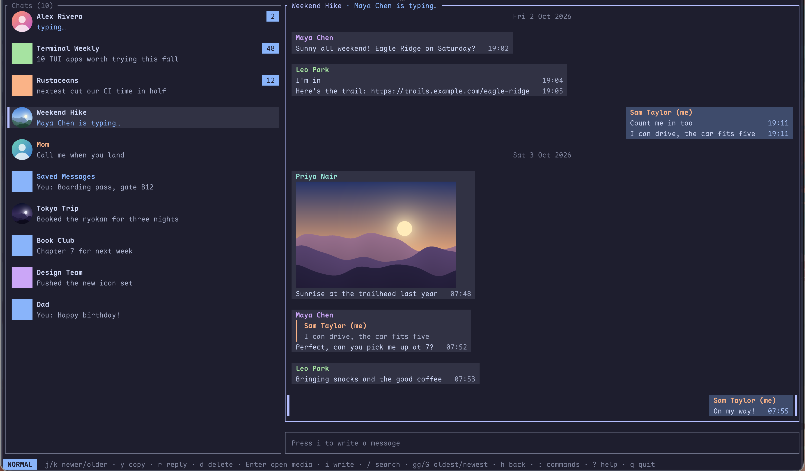
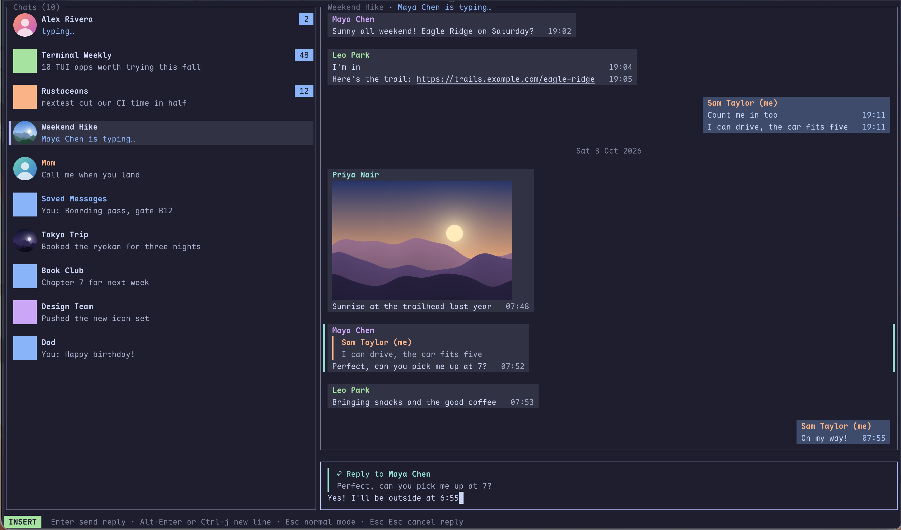
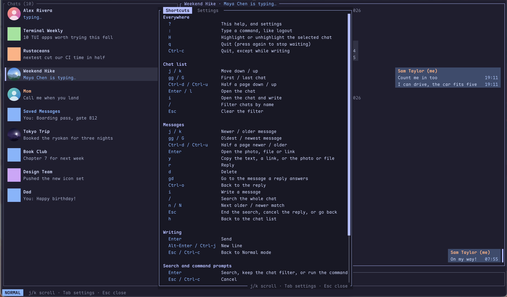

<div align="center">

# tuigram

**Telegram at the speed of your keyboard.**

A terminal Telegram client (TUI) with vim keys, inline photos, reactions and search across your whole history.<br>
Written in Rust on [TDLib](https://github.com/tdlib/td), the library behind Telegram's own apps.

[](https://github.com/erictran308/tuigram/releases/latest)
[](https://crates.io/crates/tuigram-cli)
[](LICENSE)

**[Download for macOS, Linux or Windows](#get-started)** and log in. Nothing to set up.<br>
With Rust: `cargo binstall tuigram-cli` gets the same ready-made app.



</div>

---

## Why tuigram

- **Your real account, not a bot.** Log in by scanning a QR code with Telegram on your phone, or with your phone number and the code Telegram sends, plus your two-step password if you have one, just like the official apps.
- **Vim all the way.** Normal mode to move around (`j`/`k`, `gg`/`G`, `Ctrl-d`/`Ctrl-u`), `i` to write, `Esc` to stop. Your hands never leave the keyboard.
- **Photos and stickers, inline.** Real images in kitty, Ghostty, WezTerm and iTerm2, and block-character previews in any other terminal.
- **React with emoji.** `R` opens the emoji the chat allows, and `/` finds one by name (`heart`, `fire`, `+1`). `X` takes yours back.
- **Send stickers.** `Tab` while writing opens your recent and favorite stickers and the sets you added, and `/` finds more by emoji or word.
- **Search everything.** `/` in the chat list filters chats as you type. `/` inside a chat searches its entire history, and `n`/`N` jump between matches, highlighted where they appear.
- **Find anyone.** `s` finds a chat by name, or anyone on Telegram by `@username` or `t.me` link: your contacts, public groups and channels, invite links (it asks before joining) and links to a message.
- **Forward.** `f` sends the selected message, or a whole album, to another chat, with "Forwarded from" as in Telegram.
- **Polls and link previews.** Polls show their answers, and how people voted once you have; `Enter` votes. Links show the page's title and a few lines of it, under the site they really go to, beside a small picture where the terminal shows images.
- **Write faster.** `@` and a few letters suggests people in the group, `:` and a few letters suggests emoji (`:tada` 🎉); `Tab` puts one in.
- **Feels like Telegram.** Message bubbles with yours on the right, sender names in color, **bold**, *italic*, `code` and spoilers (hidden until `Enter`), reactions under them, ✓ / ✓✓ when yours are sent and read, date separators, "typing…" while someone writes to you, when they were last seen, and unread chats on top.
- **Open anything.** Press `Enter` on a photo, video, file or link to open it in your default app. Telegram links (`t.me/…`) open right in tuigram: the chat, the message, or an invite, which asks before joining.
- **Send photos and files.** Drop them on the window, paste a screenshot with `p`, or type a path with `a` (Tab completes it). What you write goes with them as the caption, and several photos go as one album.
- **Notifications.** New messages pop up as system notifications while you're in another window, and the window title counts your unread chats. Telegram's mute settings apply.
- **Make it yours.** Catppuccin, Tokyo Night, Dracula, Gruvbox, Nord and Rosé Pine themes or [your own](#themes), and highlights that make your important chats stand out.
- **Private by design.** tuigram talks only to Telegram. No telemetry, no accounts and no servers in between. Your session stays on your machine, and read receipts go out only for messages you've actually had in front of you.
- **Careful with what others send.** A file that could run a program, or a link whose text hides where it really goes, asks before opening.

<table>
  <tr>
    <td></td>
    <td></td>
  </tr>
  <tr>
    <td align="center">Reply with <code>r</code>, write in Insert mode, send with <code>Enter</code></td>
    <td align="center">Every shortcut is one <code>?</code> away</td>
  </tr>
</table>

## Get started

There are two ways to install tuigram:

- **Download it** (or `cargo binstall tuigram-cli`). Ready-made apps come with tuigram's own Telegram API key, so you just log in.
- **Build it from source** with `cargo install`. You bring your own API key, which takes two minutes on Telegram's site.

To look around first, `tuigram --demo` shows made-up chats without logging in: `1`–`5` switch scenes, `t` changes the theme, `q` quits.

### Download (recommended)

**1. Install.** If you have Rust and [cargo-binstall](https://github.com/cargo-bins/cargo-binstall), that's one command, on any system:

```sh
cargo binstall tuigram-cli
```

Otherwise, on macOS or Linux, paste this into a terminal. It puts `tuigram` in `~/.local/bin`:

```sh
mkdir -p ~/.local/bin
curl -fsSL https://github.com/erictran308/tuigram/releases/latest/download/tuigram-aarch64-apple-darwin.tar.gz | tar xz -C ~/.local/bin tuigram
```

Swap the file name for your computer's:

| Computer | File |
| --- | --- |
| Mac with Apple silicon (M1 or later) | [`tuigram-aarch64-apple-darwin.tar.gz`](https://github.com/erictran308/tuigram/releases/latest/download/tuigram-aarch64-apple-darwin.tar.gz) |
| Mac with Intel | [`tuigram-x86_64-apple-darwin.tar.gz`](https://github.com/erictran308/tuigram/releases/latest/download/tuigram-x86_64-apple-darwin.tar.gz) |
| Linux, x86_64 | [`tuigram-x86_64-unknown-linux-gnu.tar.gz`](https://github.com/erictran308/tuigram/releases/latest/download/tuigram-x86_64-unknown-linux-gnu.tar.gz) |
| Linux, ARM64 | [`tuigram-aarch64-unknown-linux-gnu.tar.gz`](https://github.com/erictran308/tuigram/releases/latest/download/tuigram-aarch64-unknown-linux-gnu.tar.gz) |
| Windows, x86_64 | [`tuigram-x86_64-pc-windows-msvc.zip`](https://github.com/erictran308/tuigram/releases/latest/download/tuigram-x86_64-pc-windows-msvc.zip) |
| Windows, ARM64 | [`tuigram-aarch64-pc-windows-msvc.zip`](https://github.com/erictran308/tuigram/releases/latest/download/tuigram-aarch64-pc-windows-msvc.zip) |

- **Windows:** download the `.zip`, unzip it, and run `tuigram.exe` from Windows Terminal.
- **Linux:** needs Ubuntu 24.04, Debian 13, Fedora 40 or newer, plus libc++: `sudo apt install libc++1` (Fedora: `sudo dnf install libcxx`).
- **macOS:** if you downloaded the file in a browser instead, macOS blocks the app. Run `xattr -d com.apple.quarantine tuigram` once to allow it.

If `tuigram` isn't found afterwards, add `~/.local/bin` to your `PATH`. Each file comes with a signed record of the commit it was built from; to check one, run `gh attestation verify <file> --repo erictran308/tuigram`.

**2. Run it.**

```sh
tuigram
```

**3. Log in.** Type your phone number, or press Tab and scan the QR code with Telegram on your phone. That's it: next time, `tuigram` takes you straight to your chats.

### Build from source

**1. Install.** You need [Rust](https://rustup.rs). `cargo install` always builds from source (unlike `cargo binstall` above). The first build downloads TDLib and takes a few minutes. On Linux, install libc++ first (`sudo apt install libc++-dev libc++abi-dev`).

```sh
cargo install tuigram-cli
```

Works on Linux, macOS and Windows, on x86_64 and ARM64.

**2. Get your API key (once).** Builds from source have no API key: their code is public, and a key published there would get blocked by Telegram for everyone. Sign in at [my.telegram.org](https://my.telegram.org), open **API development tools**, and create an app with any name.

**3. Run it.** Type `tuigram`, paste your `api_id` and `api_hash` when asked, then log in with your phone number or a QR code. tuigram saves the key, so you only do this once.

### Using your own API key

The downloaded app can use your own key too, so your access never depends on tuigram's. Set `TG_API_ID` and `TG_API_HASH` in your environment, or add the key to `settings.toml` in [your data folder](#your-data):

```toml
[api_keys]
id = 1234567
hash = "0123456789abcdef0123456789abcdef"
```

tuigram uses the first key it finds, in this order: the environment, `settings.toml`, then the built-in key. If Telegram ever stops accepting the built-in key, tuigram asks for your own instead.

## Keys

The status bar always shows the keys for where you are. The essentials:

| Key | Action |
| --- | --- |
| `j` / `k` | Move down / up |
| `gg` / `G` | Jump to top / bottom |
| `Ctrl-d` / `Ctrl-u` | Half a page down / up |
| `Enter` / `l` | Open a chat, or the file or link in a message (files that could run code, and links that hide their address, ask first: `y` opens). On a message with spoilers, `Enter` shows them first; on a poll, it votes; a `t.me` link opens in tuigram |
| `h` / `Esc` | Back to the chat list. To have the list on the right, tick **On the right side of the window** in `?` > **Settings**; `h` and `l` then swap, to follow the screen |
| `i` | Write a message: `Enter` sends, `Alt-Enter` or `Ctrl-j` starts a new line. `@name` or `:emoji` shows suggestions, and `Tab` puts one in. You stay in Insert mode to write the next one, unless you tick **Back to Normal mode after sending** in `?` > **Settings** |
| `Tab` | While writing: stickers. `h/j/k/l` pick one, `H` / `L` switch between Recent, Favorites and your sets, `/` finds stickers by emoji or word, `Enter` sends |
| `y` | Copy the selected message: its text, a link, or the photo or file |
| `r` | Reply to the selected message (`Esc` twice cancels the reply) |
| `f` | Forward the selected message, or its whole album: type part of a chat's name, `Enter` sends it there |
| `e` | Edit your message, its formatting written as Markdown: `Enter` saves, `Esc` twice cancels |
| `R` | React to the selected message: pick an emoji, or type `/` and its name (`heart`, `+1`); `Enter` on one of yours takes it back |
| `X` | Take back all your reactions to the selected message, without the popup |
| `gd` / `Ctrl-o` | Go to the message a reply answers / back to the reply |
| `d` | Delete the selected message, for everyone or just you (asks first) |
| `/` | Search chat names, or messages in the open chat |
| `n` / `N` | Next older / newer match |
| `H` | Highlight a chat |
| `s` | Find a chat or person: type a name, an `@username` or a `t.me` link, then `Enter` opens it. In a public group or channel you're not in, `i` asks to join |
| `Ctrl-r` | Resize the panes: `h` / `l` move the line between them left / right, `=` puts it back as at first, `Enter` keeps it (also next time), `Esc` cancels |
| `:` | Run a command, typed in full: `:leave` leaves the group or channel (asks first), `:logout` logs out of Telegram on this computer |
| `?` | Every shortcut, plus settings and themes |
| `q` | Quit |

### Formatting

Write Markdown the way Telegram Desktop takes it, and the message goes out formatted:

| You write | It shows |
| --- | --- |
| `**bold**` | **bold** |
| `__italic__` | *italic* |
| `~~strikethrough~~` | ~~strikethrough~~ |
| `\|\|spoiler\|\|` | hidden until tapped (or `Enter` in tuigram) |
| `` `code` `` | `code` |
| ` ```code block``` ` | a block of code |
| `[words](https://example.com)` | a link behind the words |

Markup that isn't closed stays as you typed it, so `2*3*4` or `snake_case` are left alone. Captions work the same, and `e` puts a message back in Markdown to edit it.

## Notifications

While tuigram's window is in the background, new messages show as notifications from your terminal: messages that arrive together become one, and a busy chat stays quiet for half a minute after each. Chats you muted in Telegram stay silent.

They work in Ghostty, kitty, WezTerm, iTerm2, foot and Konsole, also over SSH. In Windows Terminal, turn on `compatibility.allowOSC777` in its settings. Other terminals ring the bell instead. In tmux, add `set -g allow-passthrough on` and `set -g focus-events on` to `~/.tmux.conf`. Where the terminal can't say when you switch away (tmux without `focus-events`, GNU screen), tuigram counts you as away after a minute without a key press: new messages then notify, and aren't marked as read until you're back. Where it can, messages stop being marked as read after five minutes without a key press, in case the screen was left on. Time the computer spent asleep counts as time away.

To turn them off or on, press `?`, go to **Settings**, and press `Space` or `Enter` on **Notifications**; it's saved at once. To pick how they're sent, set `notifications` in `settings.toml` (in [your data folder](#your-data)) to `"bell"`, `"osc9"`, `"osc777"` or `"osc99"`; the default `"auto"` picks for your terminal.

Like Telegram Desktop, tuigram shows you as online while its window is focused and you've pressed a key in the last minute, so notifications arrive right away instead of waiting to see if you read them on your phone.

## Themes

Press `?`, go to **Settings**, and pick a theme at the bottom of the list: Catppuccin (Latte, Frappé, Macchiato, Mocha), Tokyo Night, Dracula, Gruvbox, Nord or Rosé Pine. It's saved at once.

To make your own, put a `.toml` file in the `themes` folder inside [your data folder](#your-data), then pick it in the same list. tuigram reads the folder again each time `?` opens, so you can edit a theme and see the change by pressing `?`. A theme can start from another one and change only a few colors:

```toml
# themes/my-mocha.toml
name = "My Mocha"    # what the list shows; the file name otherwise
inherits = "mocha"   # a built-in theme's file name, or one of yours

[palette]
blue = "#7aa2f7"     # your bubbles, unread counts and the rest follow

[colors]
bg = "reset"         # let the terminal's own background show through
search = "orange"
```

Sixteen `[palette]` colors make a whole theme: `bg`, `bg_alt`, `surface`, `overlay`, `comment`, `subtext`, `fg`, `red`, `orange`, `yellow`, `green`, `cyan`, `blue`, `purple`, `pink` and `accent`. To start one, copy a [built-in theme](themes/); [mocha.toml](themes/mocha.toml) says what each color paints. A file named like a built-in theme, such as `mocha.toml`, replaces it, and `inherits = "mocha"` in it then means the original.

`[colors]` sets single things, to a palette color, `"#rrggbb"`, or `"reset"` for the terminal's own color:

| Name | What it paints | Unless set |
| --- | --- | --- |
| `bg`, `fg` | Background and text | `bg`, `fg` |
| `subtle` | Chat previews, photo placeholders | `subtext` |
| `muted` | Key hints, dates, placeholders | `comment` |
| `border` | Borders of the pane not in use | `overlay` |
| `accent` | The pane in use, cursors, popups | `accent` |
| `selection` | The selected row | `surface` |
| `popup_bg` | Popups | `bg_alt` |
| `primary` | Unread counts, NORMAL, Saved Messages | `blue` |
| `highlighted` | Chats you highlighted with `H` | `orange` |
| `insert`, `command`, `search` | INSERT, COMMAND and SEARCH; search matches | `green`, `purple`, `yellow` |
| `error` | Errors, messages that failed to send, deleting | `red` |
| `warning` | "Are you sure" popups, things still in progress | `yellow` |
| `success` | Notes that something worked | `green` |
| `reply`, `edit` | The bar over the composer, and the message it's about | `cyan`, `orange` |
| `activity` | "typing…" | `blue` |
| `attach` | Files waiting to be sent | `blue` |
| `code` | Code in messages | `green` |
| `own_bubble`, `other_bubble` | Your messages, and other people's | `bg` tinted `blue`, `surface` |
| `own_meta`, `other_meta` | The time and ✓ on them | `fg` mixed with `blue`, `subtext` |
| `own_reaction`, `other_reaction` | Reactions on them | A shade off the bubble |
| `your_reaction` | Reactions you added | `blue` |
| `names` | Seven colors for people's names in groups | `red`, `orange`, `purple`, `green`, `cyan`, `blue`, `pink` |
| `qr_dark`, `qr_light` | The QR code for logging in | Near black, near white |

If a theme can't be used, tuigram says why in the status bar and uses Catppuccin Mocha until the file is fixed.

## Your data

Everything lives in one folder on your machine (`tuigram --help` prints its path):

| OS | Location |
| --- | --- |
| macOS | `~/Library/Application Support/tuigram` |
| Linux | `~/.local/share/tuigram` |
| Windows | `%LOCALAPPDATA%\tuigram` |

It holds your login session, API keys, downloaded files, settings and [your own themes](#themes). Deleting it removes your session from this computer. To end the session completely, go to **Settings → Devices** in another Telegram app.

Environment variables:

| Variable | Use |
| --- | --- |
| `TG_DATA_DIR` | Keep the data folder somewhere else |
| `TG_API_ID`, `TG_API_HASH` | Use your own API key instead of the saved or built-in one |

## Development

```sh
git clone https://github.com/erictran308/tuigram && cd tuigram
cargo run       # uses the same data folder as the installed app, or TG_DATA_DIR
cargo test
```

Copy `.env.example` to `.env` to keep a separate development session (for example `TG_DATA_DIR=./.tdlib`). Only development builds (`cargo run`) read `.env`: an installed tuigram ignores it, so a `.env` in a folder you cloned can't choose where your session is kept.

## Built with

- [TDLib](https://github.com/tdlib/td) through [tdlib-rs](https://github.com/FedericoBruzzone/tdlib-rs)
- [ratatui](https://ratatui.rs) and [ratatui-image](https://github.com/benjajaja/ratatui-image)
- Colors from [Catppuccin](https://catppuccin.com), [Tokyo Night](https://github.com/folke/tokyonight.nvim), [Dracula](https://draculatheme.com), [Gruvbox](https://github.com/morhetz/gruvbox), [Nord](https://www.nordtheme.com) and [Rosé Pine](https://rosepinetheme.com)

## License

[MIT](LICENSE)
